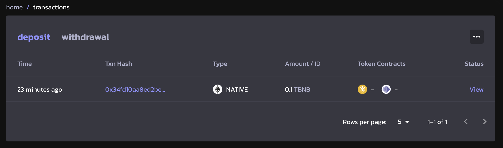
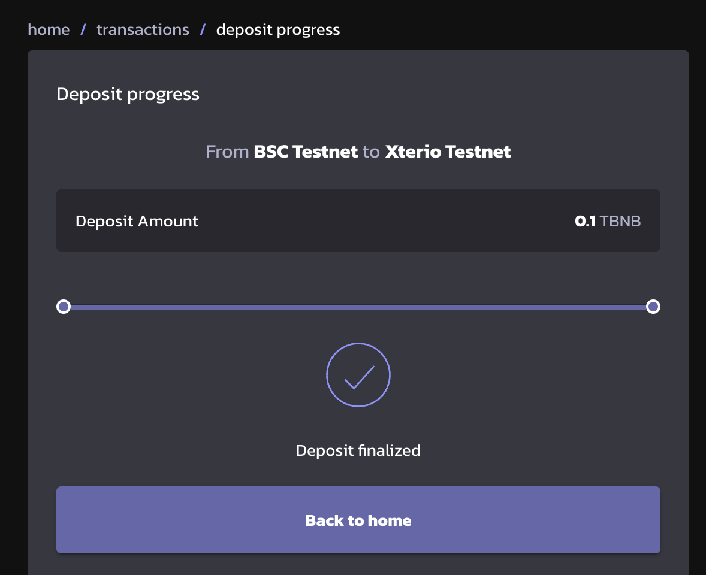

# Deposit to Xterio Chain

Bridging assets to Xterio Chain takes less than 5 minutes.

To bridge funds to Xterio Chain you can use our Bridge([Mainnet]((https://bridge.xter.io/deposit)) / [Testnet](https://op-bridge.alt.technology/deposit?id=1637450)) and follow these steps:

1. Connect your wallet to the Xterio Bridge.
2. Make sure you select the right asset that you want to bridge and that the "From" chain is BSC.
3. Fill in the amount of BNB that you want to bridge. Ensure you have a positive balance of BNB on the BSC Chain.
4. Click on "Deposit" and wait for the transaction to go through.

When the transaction is successful, the transaction details can be seen by clicking on the "View recent transactions".

1. Click on the Txn Hash itself, it will jump to [BscScan](https://bscscan.com/) Transaction Detials page.
2. Click on "view", it will jump to transaction status page below.

 Wait for less than 5 minutes to see the transaction show up with the status "Deposit finalized".