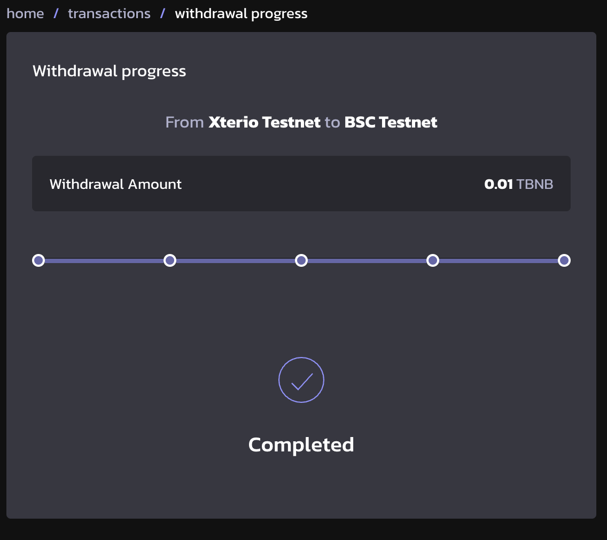

# Withdraw from Xterio Chain

Bridging assets from Xterio Chain takes around 7 days.

The whole process requires two steps. The two-step withdrawal process is designed to ensure the safety and integrity of cross-chain transactions.

## Step 1: Initiate withdrawal

First, Connect your wallet to the Xterio Bridge ([Mainnet]((https://bridge.xter.io/withdraw)) / [Testnet](https://op-bridge.alt.technology/withdraw?id=1637450)). Make sure you've already switched the network to Xterio Chain.

Then, fill in the amount of BNB that you want to bridge. Ensure you have a positive balance of BNB on the Xterio Chain.

Click on "Withdraw" and wait for the transaction to go through.

  
  
When the transaction is successful, the transaction details can be seen by clicking on the "View recent transactions".

  

1. Click on the Txn Hash itself, it will jump to [BscScan](https://bscscan.com/) Transaction Detials page.
2. Click on "view", it will jump to transaction status page below.

### Understanding the individual status of withdrawals

#### Stage 1:  Waiting for state root to be published

State root is a cryptographic commitment to the entire state of the L2 system at a specific block height. This root is then published to the L1 blockchain, where it is secured by L1's consensus mechanism and can be challenged later.

#### Stage 2: Ready for prove

After waiting for 1 hour, your transaction should be on the stage of "Ready for prove".

Click on the "Prove Message" button and submit a transaction, this will turn to Stage 3.

#### Stage 3: Waiting for challenge period. 

[Challenge period](https://docs.optimism.io/builders/app-developers/bridging/messaging#understanding-the-challenge-period) is crucial for ensuring the integrity and security of the transactions. 

After 7 days of challenge period, the withdrawal is deemed valid and is finalized on the blockchain. Now let's turn to Step 2.

## Step 2: Finalise withdrawal

From now on, the withdrawal can be finalized on the L1. 

Click on "Finalize Message" in the transaction status page, to complete the withdrawal finalization process.

You should see the funds in your wallet on the BSC network shortly. 

