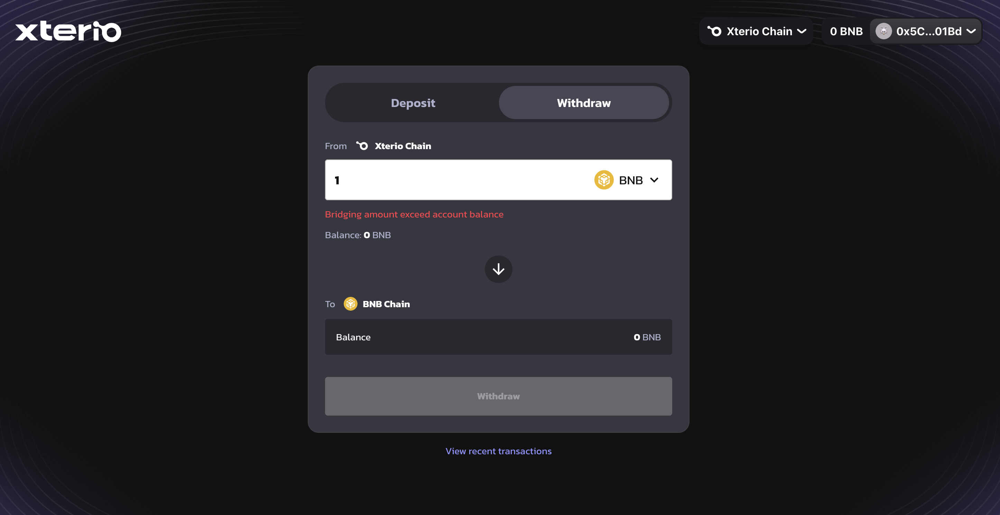
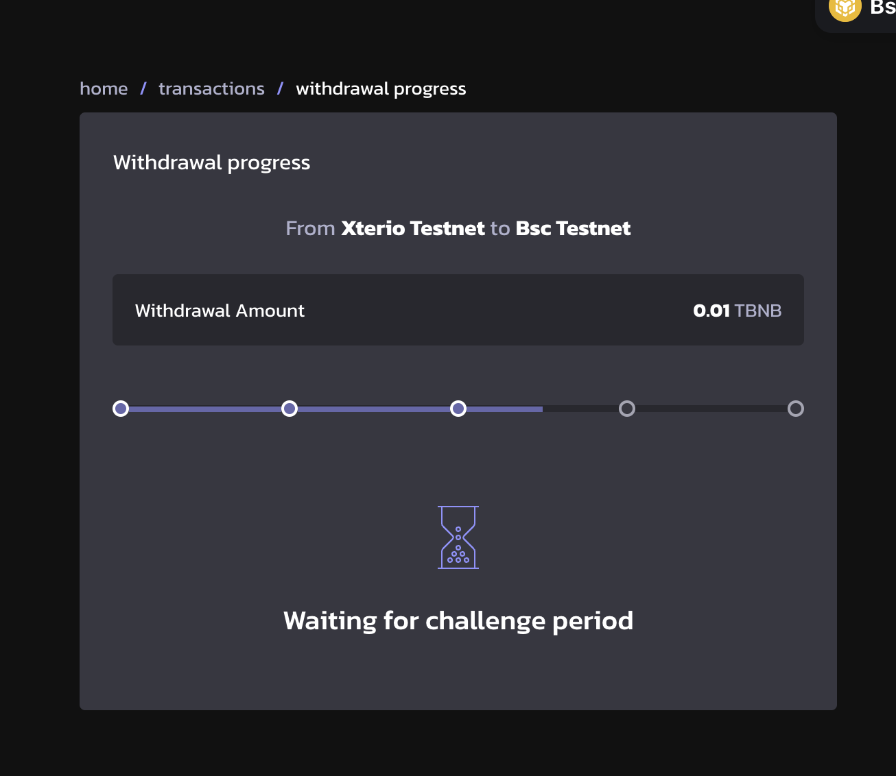

# Withdraw from Xterio Chain

Bridging assets from Xterio Chain takes around 7 days.

The whole process requires two steps. The two-step withdrawal process is designed to ensure the safety and integrity of cross-chain transactions.

### Step 1: Initiate withdrawal

First, Connect your wallet to the Xterio Bridge.Make sure you've already switched the network to Xterio Chain.

Then, fill in the amount of BNB that you want to bridge. Ensure you have a positive balance of BNB on the Xterio Chain.

Click on "Withdraw" and wait for the transaction to go through.

When the transaction is successful, the transaction details can be seen by clicking on the "View recent transactions".

The status of a withdrawal transaction can be ordered into the following stage:

a. Waiting for state root to be published

b. Ready for prove. Click on the "Prove Message" button to prove the message in BSC Chain, this will start the 7 day waiting period for the withdrawal.

c. Waiting for challenge period. 

### Step 2: Finalise withdrawal

After the withdrawal delay period of 7 days is over, the withdrawal can be finalized on the L1. 
Click on "Finalize Message" in the transaction status page, to complete the withdrawal finalization process.

