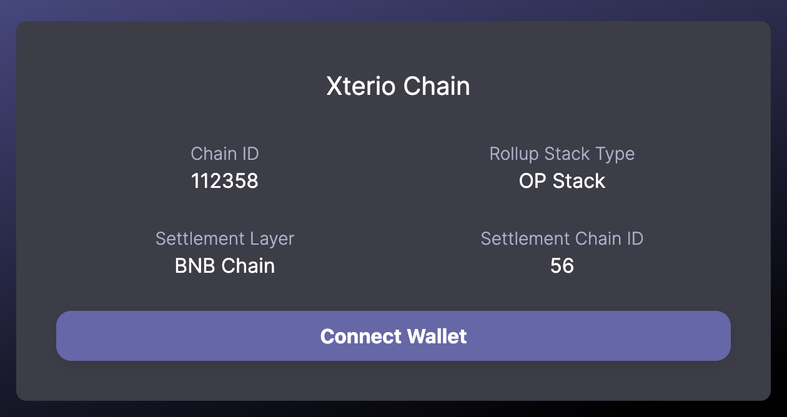

# Add Form Testnet to Metamask

## Using the Xterio Chain Rollup Info Page

1. Navigate to our [Rollup Info Page](https://rollup-info.altlayer.io/garment-primary-minute/xterio)
2. Click on the "**Add to Wallet**" button

## Manually add via Metamask

You can add the network manually using the following details:

| Parameter | Value |
| --- | --- |
| Network Name | Xterio Chain |
| RPC URL | https://xterio.alt.technology |
| Chain ID | 112358 |
| Currency Symbol | BNB |
| Block explorer URL | https://xterscan.io |