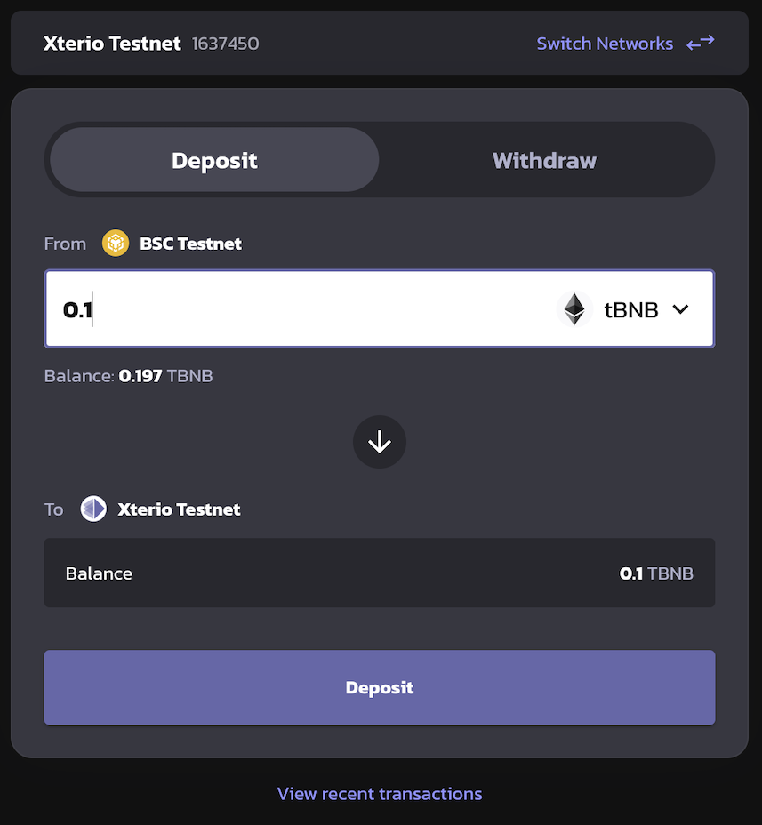

# Bridging for Xterio Chain

## Depositing to Xterio Chain

Navigate to the [Xterio Chain bridge](https://bridge.xter.io/deposit). Ensure you have a positive balance of BNB on the BSC Chain.

Enter the desired amount to deposit, connect your browser wallet (eg. Metamask) to the bridge app, and press the button to deposit funds.

The deposit will take ~5mins to reach Xterio Chain.

## Withdrawing from Xterio Chain

Withdrawals from the Xterio Chain bridge requires two steps.

### Step 1: Initiate withdrawal

Navigate to the "Withdraw" tab, and enter in the amount of BNB to withdraw. Then, press the "Withdraw" button and confirm the withdrawal transaction in Metamask.

### Step 2: Finalise withdrawal

After the withdrawal delay period of 7 days is over, the withdrawal can be finalized on the L1. 

Navigate to the [pending withdrawal page](https://bridge.xter.io/transactions?type=withdrawal), select the transaction that is ready for proving, and click on "Prove" to complete the withdrawal finalization process.

