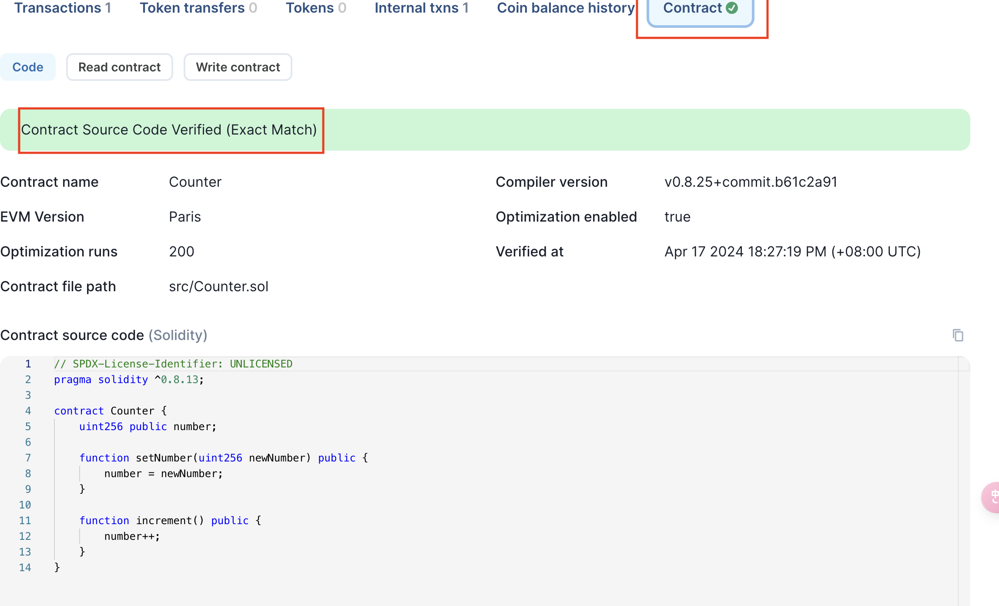

# Verify using Hardhat

Verifying a smart contract on the blockchain is an essential step to ensure its transparency, security and ease of interaction for users and other developers. 

This project is a demonstration of how to verify a contract on blockscout using hardhat.

1. Clone repository
    ```
    git clone https://github.com/alt-research/contract-verify-sample.git
    ```

2. Navigate to `hardhat` folder
    ```
    cd hardhat
    ```

3. Install dependencies
    ```
    yarn
    ```

4. Modify the `network` part in `hardhat.config.ts`
    ```
    networks: {
        xterio: {
        url: 'https://xterio.alt.technology',
        chainId: 112358,
        // test account: 0x3d96d0e5932A20518E60f39ef3AbF81a37C6231E
        accounts: ["0xfed4030d3379f87b009e9011b83c9e89a9d16411b039e7ca718453c2bd0d3aac"],
        }
    },
    ```

5. Configure etherscan
    ```
    etherscan: {
    // dummy key "abc"
    apiKey: {
      xterio: "abc",
    },
    customChains: [
      {
        network: "xterio",
        chainId: 112358,
        urls: {
          apiURL: "https://xterio.alt.technology",
          browserURL: "https://xterscan.io"
        }
      },
    ]
    }
    ```

6. Deploy sample contract
    ```
    npx hardhat run deploy.ts 
    // deploy address = 0x5FC8d32690cc91D4c39d9d3abcBD16989F875707
    ```

7. Verify sample contract
    ```
    npx hardhat verify --network xterio 0x5FC8d32690cc91D4c39d9d3abcBD16989F875707
    ```

8. Confirm verification 
   
   After executing the relevant command, visit the Mode explorer ([Mainnet](https://xterscan.io) / [Testnet](https://xterio-testnet-explorer.alt.technology/)) to see your contract's status.

   